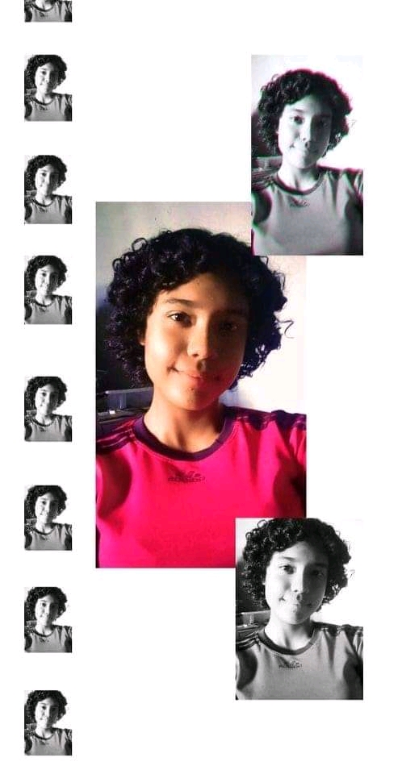

<html>
    <head>
        <title>
          mi Ultimo deseo
      </title>
      <link href="https://fonts.googleapis.com/css?family=Courgette|Open+Sans&display=swap" rel="stylesheet"> 
    </head>
    <link rel="stylesheet" href="css.css">
    <body>
        
    <section>
    <h2>
       Te Amo Arnelis Dayana 
      </h2>
  

     

     
  </img>

      
</img>

      
  </img>

      
</img>

       
 </img>

     
   

     

            
     

     
     

     
  </img>

      
</img>

      
  </img>

      
</img>

       
 </img>

     
   

     

            
     

     
     

     
  </img>

      
</img>

      
  </img>

      
</img>

       
            
     

     </section>

    </body>
</html>
body {
    margin:0;
    padding:0;
    overflow:hidden;
    background-color:black;
    }
    section{
    height:100%;
    width:100%;
      position:absolute ;  background:radial-gradient(#333,#000);
    }
    .leaf{
        position:absolute ;
        width:100%;
        height:100%;
        top:0;
        left:0;
    }
    .leaf div{
    position:absolute ;
    display:block ;
    }
    .leaf div:nth-child(1){
        left:20%; 
        animation:fall 15s linear infinite ;
        animation-delay:-2s;
    
    }
    .leaf div:nth-child(2){
        left:70%; 
        animation:fall 15s linear infinite ;
        animation-delay:-4s;
    }
    .leaf div:nth-child(3){
        left:10%; 
        animation:fall 20s linear infinite ;
        animation-delay:-7s;
        
    }
    .leaf div:nth-child(4){
        left:50%; 
       animation:fall 18s linear infinite ; 
       animation-delay:-5s;
    }
    .leaf div:nth-child(5){
        left:85%; 
        animation:fall 14s linear infinite ;
        animation-delay:-5s;
    }
    .leaf div:nth-child(6){
        left:15%; 
        animation:fall 16s linear infinite ;
        animation-delay:-10s;
    }
    .leaf div:nth-child(7){
        left:90%; 
        animation:fall 15s linear infinite ;
        animation-delay:-4s;
    }
    
    @keyframes fall{
        0%{
            opacity:1;
            top:-10%;
            transform:translateX (20px) rotate(0deg);
        }
        20%{
            opacity:0.8;
            transform:translateX (-20px) rotate(45deg);
        }
        40%{
    
            transform:translateX (-20px) rotate(90deg);
        }
        60%{
            
           transform:translateX (-20px) rotate(135deg); 
        }
        80%{
        
            transform:translateX (-20px) rotate(180deg);
        }
        100%{
            
            top:110%;
            transform:translateX (-20px) rotate(225deg);
        }
        }
    .leaf1{
        transform: rotateX(180deg);
    }
    h2{
        position:absolute ;
        top:40%;
        width:100%;
        font-family: 'Courgette', cursive;
        font-size:4em;
        text-align:center;
        transform:translate ;
        color:#fff;
        transform:translateY (-50%);
    }
